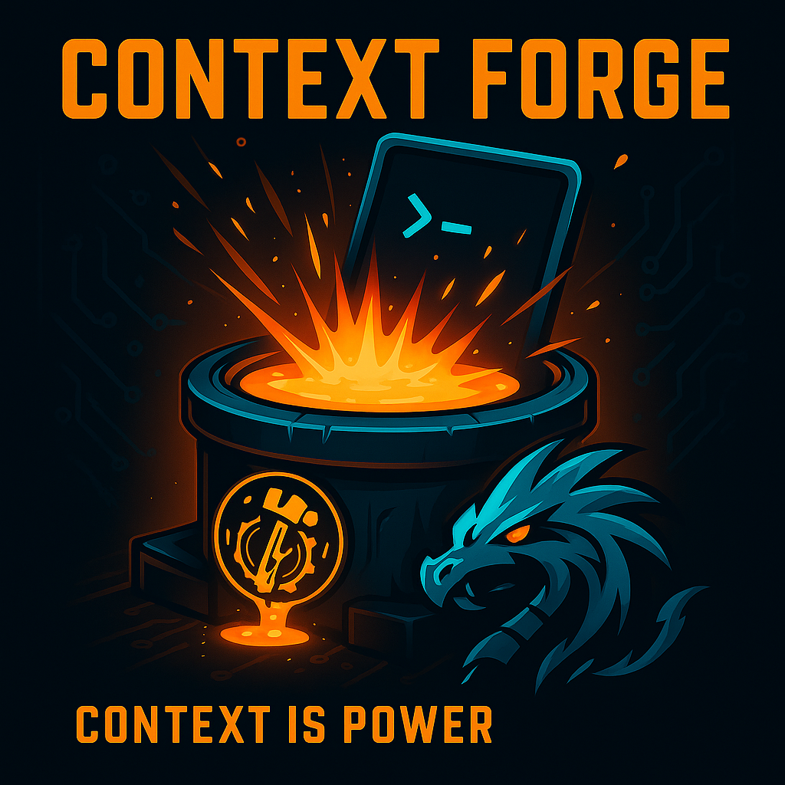

<div align="center">

# 🛠️ Context Forge

**CLI tool for instant Claude Code project scaffolding with context engineering best practices**

[](https://www.npmjs.com/package/context-forge)
[](https://www.npmjs.com/package/context-forge)
[](https://opensource.org/licenses/MIT)
[](https://www.typescriptlang.org/)
[](https://nodejs.org/)
[](https://github.com/webdevtodayjason/context-forge/releases)
[](https://github.com/webdevtodayjason/context-forge/pulls)
[](https://github.com/webdevtodayjason/context-forge)



<p align="center">
  <strong>Transform your project ideas into AI-ready applications with intelligent context engineering</strong>
</p>

<div align="center">
  <h3>🎉 NEW: Multi-IDE Support!</h3>
  <p><strong>Now supporting 7+ AI-powered IDEs and assistants!</strong></p>
  <p>
    
    
    
    
    
  </p>
  <p><em>Generate IDE-specific configurations for your favorite AI coding assistant with a single command!</em></p>
</div>

[Features](#-features) • [Quick Start](#-quick-start) • [Documentation](#-documentation) • [Credits](#-credits)

</div>

---

## 🌟 Overview

Context Forge is a powerful CLI tool that bridges the gap between project requirements and AI-assisted development. By implementing Andre Karpathy's context engineering principles, it generates comprehensive documentation structures that enable AI IDEs to understand and build your project efficiently—without hallucinations or context confusion.

### 🚀 Why Choose Context Forge?

**🌐 Universal AI IDE Support** - Works with ALL major AI coding assistants  
**⚡ Zero Configuration** - Intelligent defaults for each IDE  
**🎯 One Command** - Generate configs for multiple IDEs simultaneously  
**🔄 Format Conversion** - Switch between IDEs without starting over  
**📦 No Lock-in** - Your project, your choice of AI assistant

### 🤖 Supported AI IDEs & Assistants

<table>
<tr>
<td align="center"><br><b><a href="./docs/ide-configs/claude/">Claude Code</a></b><br><em>Full PRP support</em></td>
<td align="center"><br><b><a href="./docs/ide-configs/cursor/">Cursor IDE</a></b><br><em>PRP + MDC format</em></td>
<td align="center"><br><b><a href="./docs/ide-configs/windsurf/">Windsurf</a></b><br><em>PRP + Cascade AI</em></td>
</tr>
<tr>
<td align="center"><br><b><a href="./docs/ide-configs/cline/">Cline</a></b><br><em>Context management</em></td>
<td align="center"><br><b><a href="./docs/ide-configs/roo/">Roo Code</a></b><br><em>Hierarchical rules</em></td>
<td align="center"><br><b><a href="./docs/ide-configs/gemini/">Gemini</a></b><br><em>CLI & Code Assist</em></td>
<td align="center"><br><b><a href="./docs/ide-configs/copilot/">GitHub Copilot</a></b><br><em>Custom instructions</em></td>
</tr>
</table>

> **Coming Soon:** Amazon CodeWhisperer, Tabnine, and more!

### 📚 IDE Configuration Guides

Need help understanding how each IDE uses its configuration? Check out our detailed guides:

- **[🤖 Claude Code Guide](./docs/ide-configs/claude/)** - Full PRP support, validation system, tech-stack templates
- **[🔵 Cursor IDE Guide](./docs/ide-configs/cursor/)** - PRP support, MDC format, hierarchical rules
- **[🟩 Windsurf Guide](./docs/ide-configs/windsurf/)** - PRP support, Cascade AI integration, workflows
- **[🟢 Cline Guide](./docs/ide-configs/cline/)** - Context management, code patterns, advanced commands
- **[🟣 Roo Code Guide](./docs/ide-configs/roo/)** - Workspace rules, YAML configuration, team settings
- **[🟠 Gemini Guide](./docs/ide-configs/gemini/)** - Hierarchical context, CLI commands, Code Assist integration
- **[⚫ GitHub Copilot Guide](./docs/ide-configs/copilot/)** - Custom instructions, VS Code settings, language-specific rules

## ✨ Features

### Core Features

- 🚀 **No AI Dependencies** - Works completely offline without API keys
- 🤖 **Multi-IDE Support** - Generate configs for multiple AI IDEs at once
- 📋 **Interactive CLI** - Guided project setup with IDE selection
- 🎯 **Template-based Generation** - IDE-specific documentation formats
- 🛠️ **Multiple Tech Stacks** - Support for 9+ frameworks with specific configurations
- 📁 **Structured Output** - Organized documentation following each IDE's conventions
- ⚡ **Fast Setup** - Go from zero to AI-ready project in minutes
- 🔄 **Format Conversion** - Convert between different IDE formats (coming soon)

### Advanced Features

- 🔍 **PRP Integration** - Product Requirement Prompts with validation loops (Claude, Cursor & Windsurf)
- ✅ **Validation System** - Built-in code quality checks and gates
- 🎨 **Tech-Stack Specific Templates** - Optimized CLAUDE.md for each framework
- 📊 **Comprehensive Reporting** - Validation reports and progress tracking
- 🔧 **Extensible Architecture** - Easy to add new tech stacks and features

## 📦 Installation

```bash
npm install -g context-forge
```

[](https://npmjs.org/package/context-forge)

## 🚀 Quick Start

### Prerequisites

- Node.js 18+ and npm 7+
- Git (for version control)
- A code editor (VS Code recommended)

### Basic Usage

```bash
# Initialize a new project
context-forge init

# Or use npx without installation
npx context-forge init
```

**Note**: Context Forge is a CLI tool and should be installed globally. Do not install it as a project dependency with `npm install context-forge` as this will add unnecessary files to your project.

```bash
# Initialize in current directory
context-forge init

# Specify output directory
context-forge init --output ./my-project

# Use with existing PRD file
context-forge init --prd ./requirements.md

# Skip interactive prompts with config
context-forge init --config ./context-forge.json

# Run validation on existing project
context-forge validate
```

## 💡 Usage Examples

### Example 1: SaaS Dashboard Project

```bash
$ context-forge init

? Project name: Analytics Dashboard
? Project type: fullstack
? Project description: Real-time analytics dashboard with data visualization
? How would you like to provide the PRD? Create new PRD
? Frontend framework: nextjs
? Backend framework: fastapi
? Database: postgresql
? Select features: authentication, dashboard, realtime-updates, data-export
? Project timeline: standard
? Team size: small
? Enable PRP generation? Yes
? Enable validation system? Yes

✅ Project initialized successfully!

Generated files:
- CLAUDE.md (Next.js 15 specific configuration)
- Docs/Implementation.md (4 development stages)
- Docs/project_structure.md
- PRPs/base.md (Implementation prompt with validation gates)
- .context-forge/config.json

Next steps:
1. cd analytics-dashboard
2. Review CLAUDE.md for project rules
3. Start with Stage 1 in Docs/Implementation.md
```

### Example 2: API-Only Microservice

```bash
$ context-forge init --output user-service

? Project name: User Service
? Project type: api
? Project description: User management microservice with JWT auth
? Frontend framework: none
? Backend framework: express
? Database: mongodb
? Authentication method: jwt
? Enable Docker support? Yes
? Enable GitHub Actions? Yes

Generated structure:
user-service/
├── CLAUDE.md              # Express.js specific rules
├── Docs/
├── PRPs/
├── Dockerfile
├── docker-compose.yml
└── .github/workflows/
```

### Example 3: Using Configuration File

```bash
# context-forge.json
{
  "projectName": "E-Commerce Platform",
  "projectType": "fullstack",
  "description": "Modern e-commerce platform with AI recommendations",
  "prd": {
    "content": "# E-Commerce Platform\n\n## Overview\n...",
    "features": [
      {
        "id": "auth",
        "name": "User Authentication",
        "priority": "must-have",
        "complexity": "medium"
      },
      {
        "id": "catalog",
        "name": "Product Catalog",
        "priority": "must-have",
        "complexity": "complex"
      },
      {
        "id": "cart",
        "name": "Shopping Cart",
        "priority": "must-have",
        "complexity": "medium"
      },
      {
        "id": "ai-recommendations",
        "name": "AI Product Recommendations",
        "priority": "should-have",
        "complexity": "complex"
      }
    ]
  },
  "techStack": {
    "frontend": "react",
    "backend": "django",
    "database": "postgresql",
    "cache": "redis",
    "search": "elasticsearch"
  },
  "extras": {
    "prp": true,
    "validation": true,
    "docker": true,
    "cicd": true,
    "testing": true
  }
}

# Run with config
$ context-forge init --config context-forge.json --output ecommerce-platform
```

## 🎯 Real-World Scenarios

### Scenario 1: Startup MVP

You're building an MVP for a startup. You need to move fast but maintain quality:

```bash
# 1. Initialize with MVP timeline
context-forge init --preset startup-mvp

# 2. Review generated Implementation.md
cat Docs/Implementation.md
# Shows 2-week sprint plan with daily tasks

# 3. Start development with Claude Code
# Open CLAUDE.md in Claude Code
# Follow Stage 1 tasks systematically

# 4. Validate progress daily
context-forge validate --levels syntax,tests
```

### Scenario 2: Enterprise Migration

Migrating a legacy system to modern stack:

```bash
# 1. Create detailed PRD first
context-forge init --prd legacy-migration-prd.md

# 2. Select enterprise options
# - Choose 'enterprise' timeline
# - Enable all validation options
# - Select comprehensive testing

# 3. Generated structure includes:
# - Migration strategy in Implementation.md
# - Rollback procedures
# - Comprehensive test suites
# - Security audit checklists
```

### Scenario 3: Hackathon Project

24-hour hackathon, need to prototype fast:

```bash
# 1. Quick setup
npx context-forge init --preset hackathon

# 2. Skip optional features
# - Disable PRP (too detailed for hackathon)
# - Basic validation only
# - Focus on core features

# 3. Get building in < 5 minutes
# CLAUDE.md has simplified rules for rapid development
```

## 📚 Documentation

### Generated Files Structure

Context Forge creates IDE-specific documentation structures:

#### Claude Code (Default)
```
project-folder/
├── CLAUDE.md                    # Main context file with tech-stack specific rules
├── Docs/
│   ├── Implementation.md       # Staged development plan
│   ├── project_structure.md    # Folder organization
│   ├── UI_UX_doc.md           # Design specifications
│   └── Bug_tracking.md        # Bug tracking template
└── PRPs/                      # Product Requirement Prompts (if enabled)
```

#### Cursor IDE
```
project-folder/
├── .cursorrules               # Main Cursor rules file
└── .cursor/
    └── rules/
        ├── global.md         # Global development rules
        ├── project.md        # Project-specific rules
        ├── prp-overview.mdc  # PRP implementation overview
        ├── prp-stage-1.mdc   # Foundation setup tasks
        ├── prp-stage-2.mdc   # Core feature implementation
        ├── prp-stage-3.mdc   # Advanced features & polish
        └── prp-validation.mdc # Validation gates & checks
```

#### Cline
```
project-folder/
├── .clinerules               # Main Cline configuration
└── .clinerules/
    ├── context.md           # Project context
    ├── rules.md             # Development rules
    └── patterns.md          # Code patterns
```

#### Gemini
```
project-folder/
├── GEMINI.md                 # Main Gemini configuration
└── .gemini/
    └── context/
        ├── project.md       # Project context
        ├── architecture.md  # Architecture docs
        └── guidelines.md    # Development guidelines
```

### Understanding Generated Files

#### CLAUDE.md

The main context file that Claude Code reads first. It contains:

- Project overview and tech stack
- Development philosophy (KISS, YAGNI)
- Code structure rules and limits
- Tech-stack specific guidelines
- Testing requirements
- Pre-commit checklist

#### Docs/Implementation.md

Your roadmap with staged development:

- **Stage 1**: Foundation (1-2 weeks) - Setup, configuration, base structure
- **Stage 2**: Core Features (2-3 weeks) - Must-have functionality
- **Stage 3**: Advanced Features (2-3 weeks) - Should-have features
- **Stage 4**: Polish & Optimization (1-2 weeks) - Testing, performance

Each stage contains:

- Dependencies and prerequisites
- Detailed task checklist
- Validation requirements
- Expected deliverables

#### PRPs (Product Requirement Prompts)

Advanced prompts for complex implementations:

- **base.md** - Implementation blueprint with pseudocode
- **planning.md** - Architecture diagrams and decisions
- **spec.md** - Technical specifications
- **validation-gate.md** - Quality checkpoints

### Interactive Setup Flow

When you run `context-forge init`, you'll be guided through:

1. **Project Information** - Name, type, and description
2. **PRD Input** - Provide or create product requirements
3. **Tech Stack Selection** - Choose frontend, backend, and database
4. **Feature Selection** - Pick core features for your MVP
5. **Configuration** - Timeline, team size, and deployment
6. **Advanced Options** - PRP, validation, AI docs

### Supported Tech Stacks

#### Frontend Frameworks

- **Next.js 15** - App Router, Server Components, React 19
- **React** - SPA with TypeScript and modern patterns
- **Vue.js 3** - Composition API and TypeScript
- **Angular** - Standalone components, RxJS
- **Vanilla JavaScript** - No framework approach

#### Backend Frameworks

- **FastAPI** (Python) - Async, Pydantic v2, type hints
- **Express.js** (Node.js) - TypeScript, middleware patterns
- **Django** (Python) - MVT, ORM, admin interface
- **Spring Boot** (Java) - REST APIs, dependency injection
- **Ruby on Rails** - Convention over configuration

#### Databases

- PostgreSQL, MySQL, MongoDB, SQLite, Redis

### Validation System

Context Forge includes a powerful validation system that ensures code quality:

```bash
# Run all critical validations
context-forge validate

# Run specific validation levels
context-forge validate --levels syntax,tests

# Run all validations including optional ones
context-forge validate --all

# Generate detailed report
context-forge validate --report

# Validate in specific directory
context-forge validate --path ./my-project
```

#### Validation Levels

| Level        | Description                | Critical | Commands                        |
| ------------ | -------------------------- | -------- | ------------------------------- |
| **syntax**   | Type checking and linting  | ✅ Yes   | `tsc`, `eslint`, `mypy`, etc.   |
| **tests**    | Unit and integration tests | ✅ Yes   | `jest`, `pytest`, `rspec`, etc. |
| **coverage** | Code coverage analysis     | ❌ No    | With coverage reporters         |
| **build**    | Production build           | ✅ Yes   | Framework-specific build        |
| **security** | Vulnerability scanning     | ❌ No    | `npm audit`, `safety`, etc.     |

#### Example Validation Report

```
📊 Validation Report - Analytics Dashboard
==================================================
✅ Status: PASSED

Total: 5 | Passed: 5 | Failed: 0

✅ syntax:tsc --noEmit (342ms)
✅ syntax:eslint src --ext .ts,.tsx (567ms)
✅ tests:jest --coverage (4521ms)
✅ build:next build (8234ms)
✅ security:npm audit (1023ms)

Full report saved to: .validation-reports/latest-report.md
```

### Configuration File

Skip interactive prompts with a configuration file:

```json
{
  "projectName": "My App",
  "projectType": "fullstack",
  "description": "A collaborative platform",
  "techStack": {
    "frontend": "nextjs",
    "backend": "fastapi",
    "database": "postgresql",
    "auth": "jwt"
  },
  "features": [
    {
      "id": "auth",
      "name": "Authentication",
      "priority": "must-have"
    }
  ],
  "extras": {
    "prp": true,
    "validation": true,
    "docker": true
  }
}
```

Use with: `context-forge init --config context-forge.json`

## 🔄 Complete Workflow

### Step 1: Initialize Your Project

```bash
# Run the init command
context-forge init

# Answer the interactive prompts
# Context Forge will analyze your requirements and generate appropriate documentation
```

### Step 2: Review Generated Documentation

```bash
# 1. Start with CLAUDE.md
cat CLAUDE.md
# This is your project's "constitution" - rules Claude Code will follow

# 2. Check your implementation plan
cat Docs/Implementation.md
# This breaks down development into manageable stages

# 3. Review project structure
cat Docs/project_structure.md
# This defines how your code should be organized
```

### Step 3: Start Development with Claude Code

1. Open your project in Claude Code
2. Add the entire project folder to Claude's context
3. Start with Stage 1 tasks from Implementation.md
4. Claude will follow the rules in CLAUDE.md automatically

### Step 4: Validate Your Progress

```bash
# After completing each stage
context-forge validate

# Before committing code
context-forge validate --levels syntax,tests

# For comprehensive check
context-forge validate --all --report
```

### Step 5: Iterate and Improve

- Update Bug_tracking.md when you encounter issues
- Claude Code will learn from documented bugs
- Run validation frequently to maintain quality

## 🎮 Advanced Usage

### Custom Templates

Create your own templates in `~/.context-forge/templates/`:

```bash
# Custom tech stack template
~/.context-forge/templates/claude/my-stack.md

# Custom validation commands
~/.context-forge/templates/validation/my-validation.json
```

### Hooks and Automation

Add pre/post hooks in `.context-forge/hooks/`:

```bash
# pre-init.sh - Run before initialization
#!/bin/bash
echo "Setting up environment..."

# post-init.sh - Run after initialization
#!/bin/bash
echo "Installing dependencies..."
npm install
```

### CI/CD Integration

```yaml
# .github/workflows/validate.yml
name: Context Forge Validation
on: [push, pull_request]

jobs:
  validate:
    runs-on: ubuntu-latest
    steps:
      - uses: actions/checkout@v3
      - uses: actions/setup-node@v3
      - run: npm install -g context-forge
      - run: context-forge validate --all
```

## 🏗️ Development

```bash
# Clone the repository
git clone https://github.com/webdevtodayjason/context-forge.git
cd context-forge

# Install dependencies
npm install

# Build the project
npm run build

# Run in development mode
npm run dev

# Run tests
npm test

# Run linting
npm run lint
```

### Project Structure

```
context-forge/
├── src/
│   ├── cli/              # CLI entry point and commands
│   ├── commands/         # Command implementations
│   ├── generators/       # Document generators
│   ├── templates/        # Handlebars templates
│   ├── data/            # Tech stack configurations
│   └── types/           # TypeScript definitions
├── templates/           # Document templates
└── tests/              # Test files
```

## 🙏 Credits

### Special Thanks

This project was inspired by and built upon the work of amazing developers:

- **[Rasmus Widing (Wirasm)](https://github.com/Wirasm)** - For the incredible [PRPs-agentic-eng](https://github.com/Wirasm/PRPs-agentic-eng) project that provided the foundation for our PRP (Product Requirement Prompt) system. The PRP methodology and validation loops are directly inspired by Rasmus's groundbreaking work.
- **[AILABS (@AILABS-393)](https://www.youtube.com/@AILABS-393)** - For the excellent educational content and YouTube tutorials on AI-assisted development, prompt engineering, and Claude Code workflows
- **[AI Labs Discord Community](https://discord.gg/tqU6S6qZ)** - For feedback, ideas, and support
- **[Dynamous.ai Community](https://dynamous.ai)** - For pioneering work in AI-assisted development and collaborative innovation

### Built With

- **[Andre Karpathy](https://karpathy.ai/)** - Context engineering principles
- **[Claude Code by Anthropic](https://claude.ai/code)** - The AI assistant this tool is designed for
- **[Commander.js](https://github.com/tj/commander.js/)** - CLI framework
- **[Inquirer.js](https://github.com/SBoudrias/Inquirer.js/)** - Interactive prompts
- **[Handlebars](https://handlebarsjs.com/)** - Template engine

## 🤝 Contributing

Contributions are welcome! Please read our [Contributing Guide](CONTRIBUTING.md) for details on our code of conduct and the process for submitting pull requests.

### Ways to Contribute

- 🐛 Report bugs and issues
- 💡 Suggest new features
- 📝 Improve documentation
- 🔧 Add new tech stack templates
- 🌐 Translate documentation
- ⭐ Star the project!

## 📝 License

This project is licensed under the MIT License - see the [LICENSE](LICENSE) file for details.

## 🔗 Links

- **Repository**: [github.com/webdevtodayjason/context-forge](https://github.com/webdevtodayjason/context-forge)
- **npm Package**: [npmjs.com/package/context-forge](https://www.npmjs.com/package/context-forge)
- **Issues**: [GitHub Issues](https://github.com/webdevtodayjason/context-forge/issues)
- **Discussions**: [GitHub Discussions](https://github.com/webdevtodayjason/context-forge/discussions)

---

<div align="center">

**Made with ❤️ by the Context Forge community**

_Empowering developers to build smarter, not harder_

</div>

---

<div align="center">
  
  &nbsp;&nbsp;&nbsp;&nbsp;
  
</div>

<br>

<div align="center">
  
[](https://star-history.com/#webdevtodayjason/context-forge&Date)

</div>
