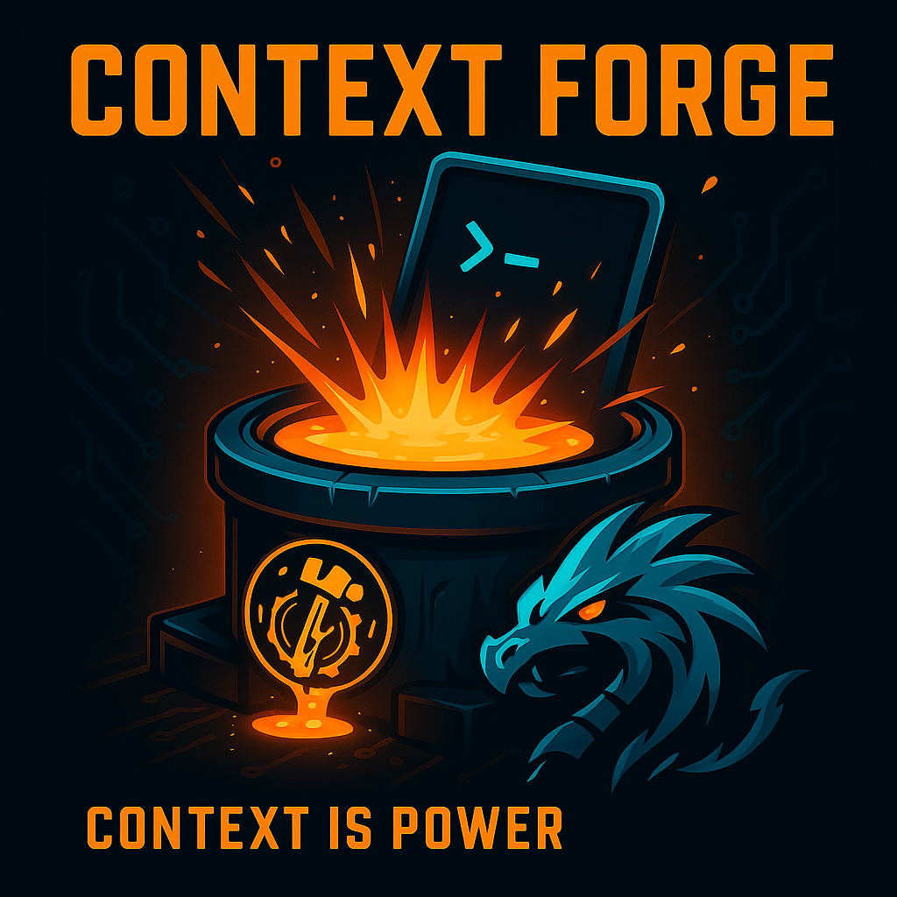

<div align="center">

# 🛠️ Context Forge

**Claude-current AI development context engine — generates the full modern Claude Code surface from one CLI**

[](https://www.npmjs.com/package/context-forge)
[](https://www.npmjs.com/package/context-forge)
[](https://opensource.org/licenses/MIT)
[](https://www.typescriptlang.org/)
[](https://nodejs.org/)
[](https://github.com/webdevtodayjason/context-forge/releases)
[](https://github.com/webdevtodayjason/context-forge/pulls)



<p align="center">
  <strong>One CLI. The whole modern <code>.claude/</code> surface — settings.json, agents, skills, slash commands, hooks, PRPs — wired correctly the first time.</strong>
</p>

<p align="center">
  <em>Tracks the 2026 Claude lineup: Opus 4.7 · Sonnet 4.6 · Haiku 4.5</em><br>
  <em>Multi-IDE: Claude · Cursor · Windsurf · Cline · Roo · Gemini · Copilot</em>
</p>

[What's New](#-whats-new-in-v400) · [Quick start](#-quick-start) · [What gets generated](#-what-gets-generated) · [Commands](#-commands) · [Roadmap](#-roadmap--v410)

</div>

---

## 🎉 What's New in v4.0.0

The first major refresh in nine months. Context-forge now generates **everything a modern (May 2026) Claude Code project expects** — and the `init` wizard is a full-screen Ink TUI.

| Area | What ships |
|---|---|
| **`.claude/settings.json` generator** | One canonical settings.json wiring `hooks` (all 8 lifecycle events), `mcpServers`, `statusLine`, `outputStyles`, and `permissions.allow` / `permissions.deny`. `$schema` points at JSON SchemaStore. |
| **Sub-agents generator** | `.claude/agents/<name>.md` files with frontmatter (`name`, `description`, `tools`, `model`). Five defaults shipped — see [Agents reference](#-agents-reference). |
| **Skills generator** | `.claude/skills/<name>/SKILL.md` with project-specific procedures. Three defaults; auto-derives test framework, language, and deploy target from your stack. |
| **Slash commands as real `.md` files** | 21 commands across 6 subdirs, each with `allowed-tools`, `argument-hint`, `description`, `model` frontmatter. No more text-snippets-in-CLAUDE.md. |
| **Modern hook lifecycle** | All 8 events wired through `settings.json`. 14 bash scripts + 4 Python (only where stdin-JSON / markdown-scanning truly warrants it). Every script is `chmod 0o755` automatically via the new `GeneratedFile.mode` field. |
| **Ink TUI wizard for `init`** | 10 keyboard-driven screens. ESC = back, Enter = advance, Ctrl-C = clean exit. `--no-tui` falls back to the legacy inquirer flow for CI and non-TTY. |
| **2026 model lineup** | Zero `claude-3-*` IDs remain in `src/`. Key validation uses Haiku 4.5; default planning is Opus 4.7; balanced default is Sonnet 4.6. SDK `^0.94.0`. |

For the full ledger of what changed, see [CHANGELOG.md](./CHANGELOG.md).

---

## 🌟 Why context-forge

- **Less yak-shaving.** Scaffolds the entire `.claude/` surface — settings, agents, skills, hooks, slash commands — in one command. No copy-pasting frontmatter, no hunting for the right schema URL.
- **Better Claude context.** Generates a tech-stack-aware `CLAUDE.md`, staged `Docs/Implementation.md`, and feature-specific PRPs (optionally AI-enhanced) so Claude Code knows your codebase from turn one.
- **Modern Claude Code surface, out of the box.** Tracks the May 2026 conventions (settings.json hooks, agents, skills, slash-commands-as-files). Upgrade once, ship everywhere.
- **Multi-IDE.** Same project context, seven IDEs: Claude · Cursor · Windsurf · Cline · Roo · Gemini · Copilot.
- **Free and offline-capable.** AI-powered PRP generation is *optional*; the deterministic template path works fully offline.
- **Adapter-clean.** Every IDE has its own adapter; every generator returns the same `GeneratedFile[]` shape. Easy to extend.

---

## 🤖 Supported AI IDEs

| IDE | Modern Claude surface | PRP support | Native config |
|---|---|---|---|
| **[Claude Code](./docs/ide-configs/claude/)** | ✅ settings.json + agents + skills + commands + hooks | ✅ | `.claude/` |
| **[Cursor](./docs/ide-configs/cursor/)** | — | ✅ MDC format | `.cursor/rules/` |
| **[Windsurf](./docs/ide-configs/windsurf/)** | — | ✅ Cascade workflows | `.windsurfrules` |
| **[Cline](./docs/ide-configs/cline/)** | — | ✅ combined markdown | `.clinerules/` |
| **[Roo Code](./docs/ide-configs/roo/)** | — | ✅ workspace rules | `.roo/rules.yaml` |
| **[Gemini](./docs/ide-configs/gemini/)** | — | ✅ CLI + Code Assist | `.gemini/` |
| **[GitHub Copilot](./docs/ide-configs/copilot/)** | — | ✅ custom instructions | `.github/copilot-instructions.md` |

> The modern `.claude/settings.json` + agents + skills surface is **Claude-specific** today. Every other IDE gets the universal artifacts — `CLAUDE.md`-equivalent, `PRPs/`, and the IDE's native config files. See [`docs/ide-configs/`](./docs/ide-configs/) for per-IDE deep dives.

---

## 🚀 Quick start

```bash
npm install -g context-forge
context-forge init
```

You'll land in the Ink TUI:

```
┌─ context-forge · init ───────────────────────────────────────────────┐
│                                                                      │
│  Welcome to context-forge                                            │
│                                                                      │
│  Let's set up Claude-current AI development context for your project.│
│                                                                      │
│  This wizard takes ~60 seconds. ESC = back, Enter = continue.        │
│                                                                      │
│  [ Continue → ]                                                      │
│                                                                      │
└──────────────────────────────────────────────────────────────────────┘
```

**For CI / non-TTY / scripts**, opt out of the TUI:

```bash
context-forge init --no-tui                        # inquirer fallback
context-forge init --config ./context-forge.json   # fully scripted
```

### Requirements

- Node.js 18+ and npm 7+
- A code editor (VS Code recommended for the modern Claude Code surface)

> **Install globally**, not as a project dependency — context-forge is a CLI, not a library.

---

## 📁 What gets generated

A typical Claude-target `init` produces:

```
my-project/
├── CLAUDE.md                         # Tech-stack-aware project rules
├── Docs/
│   ├── Implementation.md             # Staged dev plan (Stage 1–4)
│   ├── project_structure.md          # Folder organization
│   ├── UI_UX_doc.md                  # Design spec (if applicable)
│   └── Bug_tracking.md               # Bug-log template
├── PRPs/
│   ├── <project>-prp.md              # Base implementation PRP
│   ├── <project>-planning.md         # Architecture PRP (enterprise/team)
│   └── <feature>-prp.md              # One per must-have feature
├── ai_docs/
│   └── README.md                     # Optional AI-curated docs
├── .claude/
│   ├── settings.json                 # ← NEW v4.0.0 — schema-locked, full surface
│   ├── agents/                       # ← NEW v4.0.0
│   │   ├── code-reviewer.md
│   │   ├── test-runner.md
│   │   ├── plan-architect.md
│   │   ├── security-auditor.md
│   │   └── prp-executor.md
│   ├── skills/                       # ← NEW v4.0.0
│   │   ├── testing-protocol/SKILL.md
│   │   ├── deployment-checklist/SKILL.md
│   │   └── codebase-navigation/SKILL.md
│   ├── commands/                     # 21 .md files with frontmatter
│   │   ├── PRPs/        (5)
│   │   ├── orchestration/ (4)
│   │   ├── checkpoints/ (3)
│   │   ├── quality/     (3)
│   │   ├── session/     (3)
│   │   └── migration/   (3)
│   └── hooks/                        # Scripts registered via settings.json
│       ├── pre-tool-use.sh
│       ├── post-tool-use.sh
│       ├── session-start.sh
│       ├── user-prompt-submit.sh
│       ├── pre-compact.sh
│       ├── stop.sh
│       ├── subagent-stop.sh
│       ├── notification.sh
│       ├── lint-on-edit.sh
│       └── prp-tracking.py           # (Python only where it earns its keep)
└── .context-forge/
    └── config.json                   # Replay-the-init record
```

Toggle generators individually via the TUI's **Options** screen, or with `config.extras.{claudeSettings, agents, skills, hooks, claudeCommands, prp, validation, aiDocs, docker, cicd}`.

---

## 🔧 Generators

### `CLAUDE.md`

Tech-stack-aware project rules — KISS/YAGNI directives, code structure limits, testing requirements, pre-commit checklist, and a tech-stack-specific section pulled from `templates/claude/tech-stacks/`. Always emitted.

### `Docs/`

Staged development plan (`Implementation.md`), folder organization (`project_structure.md`), UX spec (`UI_UX_doc.md`), and a bug-log template (`Bug_tracking.md`). Emitted unless explicitly disabled.

### `PRPs/`

Product Requirement Prompts — Andre Karpathy-style implementation blueprints with validation gates. One base PRP plus one per must-have feature. Optionally AI-enhanced (see [AI-powered PRPs](#-ai-powered-prp-generation)). Opt out via `extras.prp: false`.

### `.claude/settings.json` — *new in v4.0.0*

Emitted by [`src/generators/claudeSettings.ts`](./src/generators/claudeSettings.ts). One canonical file wiring the full modern surface:

```json
{
  "$schema": "https://json.schemastore.org/claude-code-settings.json",
  "model": "claude-opus-4-7",
  "hooks": {
    "PreToolUse":      [{ "matcher": "Bash|Edit|Write", "hooks": [{ "type": "command", "command": "./.claude/hooks/pre-tool-use.sh" }] }],
    "PostToolUse":     [{ "matcher": "Edit|Write",      "hooks": [{ "type": "command", "command": "./.claude/hooks/lint-on-edit.sh" }] }],
    "PreCompact":      [{ "hooks": [{ "type": "command", "command": "./.claude/hooks/pre-compact.sh" }] }],
    "SessionStart":    [{ "hooks": [{ "type": "command", "command": "./.claude/hooks/session-start.sh" }] }],
    "UserPromptSubmit":[{ "hooks": [{ "type": "command", "command": "./.claude/hooks/user-prompt-submit.sh" }] }],
    "Stop":            [{ "hooks": [{ "type": "command", "command": "./.claude/hooks/stop.sh" }] }],
    "SubagentStop":    [{ "hooks": [{ "type": "command", "command": "./.claude/hooks/subagent-stop.sh" }] }],
    "Notification":    [{ "hooks": [{ "type": "command", "command": "./.claude/hooks/notification.sh" }] }]
  },
  "mcpServers": {
    "filesystem": { "command": "npx", "args": ["-y", "@modelcontextprotocol/server-filesystem", "{{CWD}}"] }
  },
  "statusLine":   { "type": "command", "command": "./.claude/statusline.sh" },
  "outputStyles": { "default": "concise" },
  "permissions":  { "allow": ["Bash(git status:*)", "Bash(npm test:*)"], "deny": ["Bash(rm -rf /:*)"] }
}
```

Opt out via `extras.claudeSettings: false`. Override individual fields with the `preferredModel`, `mcpServers`, `statusLine`, `outputStyles`, `permissionsAllow`, `permissionsDeny` fields on `ProjectConfig`.

### `.claude/agents/` — *new in v4.0.0*

Emitted by [`src/generators/agents.ts`](./src/generators/agents.ts). One `.md` file per sub-agent with frontmatter:

```markdown
---
name: code-reviewer
description: Reviews recent edits for style, security, and convention adherence.
tools: ["Read", "Grep", "Glob", "Bash(git diff:*)", "Bash(git log:*)"]
model: claude-opus-4-7
---

# Code Reviewer

You are invoked when the user wants a careful second pass over recent changes…
```

Five defaults ship; add your own via `customAgents` on `ProjectConfig`. Opt out via `extras.agents: false`.

### `.claude/skills/` — *new in v4.0.0*

Emitted by [`src/generators/skills.ts`](./src/generators/skills.ts). One `<name>/SKILL.md` per skill with frontmatter (`name`, `description`, `when_to_use`) and a Handlebars-rendered body. Auto-derives `{{testCommand}}`, `{{testFramework}}` (Jest / Vitest / Pytest / JUnit / RSpec), `{{primaryLanguage}}`, and `{{deployTarget}}` from your tech stack.

Three defaults ship; add your own via `customSkills` on `ProjectConfig`. Opt out via `extras.skills: false`.

### `.claude/commands/` — *rewritten in v4.0.0*

Emitted by [`src/generators/slashCommands.ts`](./src/generators/slashCommands.ts). 21 commands as real `.md` files with full frontmatter:

```markdown
---
allowed-tools: [Bash, Read, Grep]
argument-hint: "<feature-name>"
description: "Generate a comprehensive Product Requirement Prompt for a new feature."
model: claude-opus-4-7
---

# PRP create — $1

Compose a Product Requirement Prompt for the feature **$1**…
```

The legacy `renderCommandsForClaudeMd(config)` export is retained for projects that embed the command list directly in `CLAUDE.md`.

### `.claude/hooks/` — *modernized in v4.0.0*

Emitted by [`src/generators/hooks.ts`](./src/generators/hooks.ts), [`enhancementHooks.ts`](./src/generators/enhancementHooks.ts), and [`migrationHooks.ts`](./src/generators/migrationHooks.ts). Scripts live in `.claude/hooks/`; registration happens via `settings.json`'s `hooks` block (not via the old `.claude/hooks.yaml` convention). Every script is `chmod 0o755` automatically.

14 bash + 4 Python. Python is retained only where stdin-JSON or markdown scanning truly warrants it: `prp-tracking.py`, `dart-progress-updater.py`, `auto-task-commenter.py`, `task-code-mapper.py`.

> **Dropped:** `ContextRotation.py` — subsumed by `pre-compact.sh`'s snapshot strategy.

### AI-powered PRP generation

Optional. When enabled with `--ai-prp` (or via the TUI), context-forge calls Anthropic or OpenAI to produce feature-specific PRPs containing implementation strategy, gotchas, best practices, validation approach, and curated documentation links — instead of generic template placeholders.

```bash
context-forge ai-keys --provider anthropic   # one-time setup, AES-256-CBC encrypted at ~/.context-forge-keys
context-forge init --ai-prp                  # then init normally
```

Falls back to deterministic templates on 30-second timeout. AI calls go through the `@anthropic-ai/claude-code` `query()` wrapper today; v4.1.0's **W11** task will switch the AI paths to direct `@anthropic-ai/sdk` `messages.create` calls to unlock prompt caching and extended thinking.

---

## ⚡ Slash commands reference

21 commands across 6 subdirs, each emitted as `.claude/commands/<subdir>/<name>.md` with frontmatter:

### `PRPs/` — Product Requirement Prompts

| Command | Description |
|---|---|
| `/prp-create <feature-name>` | Generate a comprehensive PRP for a new feature. |
| `/prp-execute <prp-name>` | Execute an existing PRP end-to-end against the codebase. |
| `/prp-validate <prp-name>` | Validate that a PRP is complete enough for one-pass execution. |
| `/prp-list` | List every PRP in the repo with its status and confidence. |
| `/prp-update <prp-name>` | Refresh an existing PRP with new findings or revised context. |

### `orchestration/` — Multi-agent coordination

| Command | Description |
|---|---|
| `/orchestrate-status` | Show the current orchestration team status (panes, tasks, blockers). |
| `/orchestrate-list` | List all orchestration sessions known to this machine. |
| `/orchestrate-spawn <feature-or-task>` | Spawn a new orchestration team for a focused feature or audit. |
| `/spawn-subagents <question>` | Fan out parallel research subagents for an open question. |

### `checkpoints/` — Human-in-the-loop verification

| Command | Description |
|---|---|
| `/checkpoint-create <checkpoint-name>` | Create a named checkpoint of the current working state. |
| `/checkpoint-restore <checkpoint-name>` | Restore the working state from a named checkpoint. |
| `/checkpoint-list` | List every checkpoint with its sha, branch, and timestamp. |

### `quality/` — Validation and review

| Command | Description |
|---|---|
| `/validate` | Run the full validation gate (lint + tests + typecheck). |
| `/review [scope = HEAD]` | Comprehensive review of recent changes for quality, security, conventions. |
| `/security-scan` | Scan the codebase for common security smells. |

### `session/` — Handoffs and context priming

| Command | Description |
|---|---|
| `/session-save [label]` | Persist the current working session as a resumable handoff. |
| `/session-restore [session-name]` | Restore working context from a previously-saved session file. |
| `/prime-context` | Load project context and switch to architect or analysis mode. |

### `migration/` — Stack migrations

| Command | Description |
|---|---|
| `/migrate-analyze <target-stack>` | Analyze the current stack and identify migration paths and risks. |
| `/migrate-plan <target-stack>` | Build a phased migration plan with checkpoints and rollback strategy. |
| `/migrate-execute <phase-id>` | Execute one phase of an approved migration plan. |

The full bodies live in your generated `.claude/commands/` directory — open them, edit them, commit them.

---

## 🤖 Agents reference

Five default sub-agents land in `.claude/agents/`:

| Agent | Purpose |
|---|---|
| **`code-reviewer.md`** | Careful second pass over recent edits — style, security, convention adherence. Tools: Read, Grep, Glob, `git diff`/`log`. |
| **`test-runner.md`** | Runs the project's test command, parses output, surfaces failures with context. |
| **`plan-architect.md`** | Senior planner. Produces an implementation plan before code is written. |
| **`security-auditor.md`** | Threat-model + dependency-vuln + secret-scan pass on the diff or the whole tree. |
| **`prp-executor.md`** | Reads a PRP file, executes it end-to-end with validation gates between stages. |

Each is one `.md` file with YAML frontmatter (`name`, `description`, `tools`, `model`) plus a system-prompt body. Customize via `customAgents` on `ProjectConfig`.

---

## 🧠 Skills reference

Three default skills land in `.claude/skills/<name>/SKILL.md`:

| Skill | Purpose |
|---|---|
| **`testing-protocol`** | How to write, run, and verify tests in this project. Trigger: before claiming "tests pass" or adding new tests. Renders `{{testCommand}}`, `{{testFramework}}`. |
| **`deployment-checklist`** | Pre-deploy checklist tailored to your detected `{{deployTarget}}` (Vercel / Coolify / AWS / etc.). |
| **`codebase-navigation`** | Where things live in this project — entry points, key services, conventions. Renders `{{techStack}}`, `{{primaryLanguage}}`. |

Customize via `customSkills` on `ProjectConfig`.

---

## 🪝 Hooks reference

All 8 Claude Code lifecycle events are wired through `settings.json`. Scripts live in `.claude/hooks/`.

| Event | Default script | Job |
|---|---|---|
| `PreToolUse` | `pre-tool-use.sh` | Gate destructive tool calls; matcher `Bash\|Edit\|Write`. |
| `PostToolUse` | `lint-on-edit.sh` | Run lint on edited files; matcher `Edit\|Write`. |
| `SessionStart` | `session-start.sh` | Re-inject project context (PRPs, CLAUDE.md highlights). |
| `UserPromptSubmit` | `user-prompt-submit.sh` | Light prompt instrumentation. |
| `PreCompact` | `pre-compact.sh` | Snapshot working state before compaction. |
| `Stop` | `stop.sh` | Optional final hooks (status, commit-message draft). |
| `SubagentStop` | `subagent-stop.sh` | Subagent-specific teardown. |
| `Notification` | `notification.sh` | Routing to your notifier of choice. |

Enhancement and migration workflows extend this set with `prp-tracking.py`, `dart-progress-updater.py`, `auto-task-commenter.py`, `task-code-mapper.py`, plus several phase-specific bash hooks.

---

## 🖥️ Ink TUI walk-through

`context-forge init` runs as a 10-screen full-screen wizard. ESC = back, Enter = advance, Ctrl-C = clean exit.

```
1.  Welcome              7.  PRP & Options
2.  Project name         8.  Confirm
3.  Description          9.  Generating (live ProgressList)
4.  Tech stack           10. Done — next-steps screen
5.  Features
6.  IDE targets
```

```
┌─ context-forge · tech stack ─────────────────────────────────────────┐
│                                                                      │
│  Frontend                                                            │
│   ◉ Next.js 15        ○ Nuxt 4         ○ React (Vite)               │
│   ○ Vue 3             ○ Angular        ○ Vanilla                    │
│                                                                      │
│  Backend                                                             │
│   ○ FastAPI           ◉ Express        ○ Django                     │
│   ○ Spring Boot       ○ Rails          ○ None                       │
│                                                                      │
│  Database                                                            │
│   ◉ PostgreSQL  ○ MySQL  ○ MongoDB  ○ SQLite  ○ Redis               │
│                                                                      │
│  [ ← ESC back ]                                  [ Enter → next ]    │
└──────────────────────────────────────────────────────────────────────┘
```

The **Generating** screen renders a live `ProgressList` — one line per generator running in real time (CLAUDE.md → Docs → PRPs → settings.json → agents → skills → commands → hooks → IDE adapters).

> **Status of other commands:** Only `init` has the Ink TUI in v4.0.0. `analyze`, `enhance`, and `migrate` still use inquirer; an Ink TUI for each is on the [v4.1.0 roadmap](#-roadmap--v410).

---

## 📦 Commands

| Command | What it does |
|---|---|
| `context-forge init` | The full project-bootstrap wizard. Ink TUI by default; `--no-tui` for inquirer; `--config <path>` for fully scripted. Emits the entire generator surface. |
| `context-forge analyze` | Retrofit an *existing* codebase with AI-optimized documentation. Detects tech stack, appends to existing `CLAUDE.md` with clear markers (never overwrites), generates per-feature PRPs. |
| `context-forge enhance` | Plan and implement *new features* on an existing project. Interactive feature definition with dependencies, feasibility analysis, phased implementation strategy, per-feature PRPs, progress-tracking slash commands. |
| `context-forge migrate` | Plan a tech-stack migration. Detects shared resources (DBs, auth, APIs), assesses complexity, emits a phased plan with rollback procedures. Strategies: big-bang, incremental, parallel-run. |
| `context-forge validate` | Run the validation gate against the current project — `--levels syntax,tests,coverage,build,security`, `--all`, `--report`. |
| `context-forge run-prp <name>` | Execute a PRP end-to-end with Claude Code for one-pass implementation. |
| `context-forge copy-hooks --source <path>` | Copy hooks from another project (e.g., `claude-hooks-repo/hooks`) into the current project's `.claude/hooks/`. |
| `context-forge dashboard` | Open a lightweight progress dashboard for PRPs, checkpoints, and orchestration sessions. |
| `context-forge ai-keys --provider <openai\|anthropic>` | One-time setup for AI-powered PRP generation. Stores AES-256-CBC-encrypted keys at `~/.context-forge-keys`. |
| `context-forge config` | Inspect and edit context-forge's own configuration (`~/.context-forge/api-config.json`, project-level `.context-forge/config.json`). |
| `context-forge orchestrate` | Deploy autonomous AI-agent teams (orchestrator + PMs + workers) for long-running projects. Tmux-backed, self-scheduling, git-disciplined. |

---

## ⚙️ Configuration

### Project config — `.context-forge/config.json`

Replays your last `init` exactly. Commit it; future `init` runs against the same project re-use the answers.

```json
{
  "projectName": "Analytics Dashboard",
  "projectType": "fullstack",
  "description": "Real-time analytics dashboard",
  "techStack": {
    "frontend": "nextjs",
    "backend": "fastapi",
    "database": "postgresql",
    "auth": "jwt"
  },
  "features": [
    { "id": "auth", "name": "User Authentication", "priority": "must-have", "complexity": "medium" }
  ],
  "preferredModel": "claude-opus-4-7",
  "testCommand": "npm test",
  "deployTarget": "vercel",
  "extras": {
    "prp": true,
    "validation": true,
    "claudeSettings": true,
    "agents": true,
    "skills": true,
    "hooks": true,
    "claudeCommands": true,
    "docker": true,
    "cicd": true
  }
}
```

Run with `context-forge init --config ./context-forge.json`.

### User config — `~/.context-forge/api-config.json`

Holds AI provider settings (model overrides, timeouts). Edit via `context-forge config`. The 2026 model lineup context-forge defaults to:

| Purpose | Model ID | Notes |
|---|---|---|
| Default / planning | `claude-opus-4-7` | Deep reasoning, PRP generation |
| Balanced | `claude-sonnet-4-6` | General-purpose default for most CLI calls |
| Cheap classification | `claude-haiku-4-5-20251001` | Key validation, quick lints |

### Environment variables

- `DEBUG=1` — prints stack traces on error.
- `ANTHROPIC_API_KEY` / `OPENAI_API_KEY` — bypass the encrypted store and read directly from env.
- `CONTEXT_FORGE_TEMPLATES_DIR` — point at a custom templates directory (defaults to `~/.context-forge/templates/`).

---

## 🌐 Multi-IDE

Context-forge speaks every IDE's native config format. Same `ProjectConfig`, seven outputs. Pick one or all via the TUI's **IDE targets** screen, or via `--ide claude,cursor,windsurf` on the CLI.

For per-IDE shape (PRP layout, MDC conventions, workflow files), see:

- [Claude Code](./docs/ide-configs/claude/)
- [Cursor](./docs/ide-configs/cursor/)
- [Windsurf](./docs/ide-configs/windsurf/)
- [Cline](./docs/ide-configs/cline/)
- [Roo Code](./docs/ide-configs/roo/)
- [Gemini](./docs/ide-configs/gemini/)
- [GitHub Copilot](./docs/ide-configs/copilot/)

Plus the deep-dive Claude Code feature guides:

- [Slash Commands Reference](./docs/claude-features/slash-commands.md)
- [PRP Runner Guide](./docs/claude-features/prp-runner.md)
- [Enhanced PRP Templates](./docs/claude-features/enhanced-prp-templates.md)
- [Orchestration Workflow](./docs/claude-features/orchestration-workflow.md)
- [Dart Integration](./docs/claude-features/dart-integration.md)

---

## 🗺️ Roadmap → v4.1.0

Tracked in [CHANGELOG.md](./CHANGELOG.md) under "v4.1.0 backlog":

- **W11 — Direct SDK paths for AI features.** Migrate `AIIntelligenceService.generateFeaturePRP` and `generateSmartDefaults` from the `@anthropic-ai/claude-code` `query()` wrapper to direct `@anthropic-ai/sdk` `messages.create` calls. Unblocks **prompt caching** (5-minute TTL on large system prompts) and **extended thinking** (`thinking: { type: "enabled", budget_tokens: 4000 }`).
- **Ink TUIs for `analyze` / `enhance` / `migrate`.** Currently only `init` is wizard-driven.
- **`@anthropic-ai/claude-code` 2.x migration.** Depends on W11 — the 2.x line is CLI-only (no programmatic `query()` export).
- **Plugins.** `.claude/plugins.json` scaffolding for the Claude Code plugin marketplace.

---

## 🤝 Contributing

Contributions welcome. Until a `CONTRIBUTING.md` lands, the short version:

1. Fork → feature branch from `main`.
2. `npm install` · `npm run build` · `npm test` · `npm run lint` — all must pass.
3. New tech stack? Drop a template under `templates/claude/tech-stacks/` and wire it into the stack registry.
4. New IDE? Extend `IDEAdapter` in `src/adapters/`, implement `generateFiles()`, register in the adapter factory.
5. New generator? Return `GeneratedFile[]` from a function in `src/generators/`, then wire it into `src/generators/index.ts` and the relevant adapter.

Open an issue first for non-trivial work so we can align on scope.

---

## 🙏 Credits

This project stands on the shoulders of:

- **[Rasmus Widing (Wirasm)](https://github.com/Wirasm)** — [PRPs-agentic-eng](https://github.com/Wirasm/PRPs-agentic-eng), the foundation for our PRP system and validation loops.
- **[Andre Karpathy](https://karpathy.ai/)** — context engineering principles that shaped this tool.
- **[Anthropic](https://anthropic.com/)** — Claude Code itself, the SDK, and the modern `.claude/` surface this tool generates.
- **[AILABS (@AILABS-393)](https://www.youtube.com/@AILABS-393)** — excellent educational content on AI-assisted development workflows.
- **[Dynamous.ai Community](https://dynamous.ai)** — pioneering work in AI-assisted development.

### Built with

- **[Commander.js](https://github.com/tj/commander.js/)** — CLI framework
- **[Ink](https://github.com/vadimdemedes/ink)** — the TUI wizard for `init`
- **[Inquirer.js](https://github.com/SBoudrias/Inquirer.js/)** — the `--no-tui` fallback
- **[Handlebars](https://handlebarsjs.com/)** — template engine
- **[@anthropic-ai/sdk](https://github.com/anthropics/anthropic-sdk-typescript)** + **[@anthropic-ai/claude-code](https://www.npmjs.com/package/@anthropic-ai/claude-code)** — the Claude side

---

## 📝 License

MIT — see [LICENSE](./LICENSE).

## 🔗 Links

- **Repository:** [github.com/webdevtodayjason/context-forge](https://github.com/webdevtodayjason/context-forge)
- **npm:** [npmjs.com/package/context-forge](https://www.npmjs.com/package/context-forge)
- **Issues:** [GitHub Issues](https://github.com/webdevtodayjason/context-forge/issues)
- **Discussions:** [GitHub Discussions](https://github.com/webdevtodayjason/context-forge/discussions)

---

<div align="center">

**Made with ❤️ by the Context Forge community**

_Empowering developers to build smarter, not harder_

</div>

---

<div align="center">
  
  &nbsp;&nbsp;&nbsp;&nbsp;
  
</div>

<br>

<div align="center">

[](https://star-history.com/#webdevtodayjason/context-forge&Date)

</div>
